<h1 align="center">C-Chat</h1>

  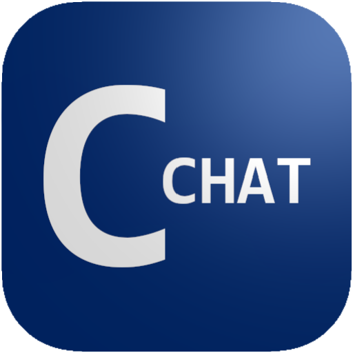
   
  <em>Aplicación de mensajería similar a WhatsApp o Discord
      Hecho con C# y Typescript</em>
    
  🔗<a href="https://c-chat-omega.vercel.app"><strong>App desplegada</strong></a>  
  📁<a href="files/C-Chat.apk" download><strong>Descargar archivo APK</strong></a>  
  🔗<a href="https://aromatic-tray-733.notion.site/Anteproyecto-C-Chat-0ca065f5e301446fb2b774a35fcd57ec?pvs=4"><strong>Anteproyecto</strong></a>

<h2 align="center">Autor</h2>

   
  Luis Miguel García Sevilla - 2º DAM Tarde

---

<h2 align="center">Información sobre la aplicación</h2>

  Web frontend realizada con <strong>Angular 18</strong>. Desplagada en <a href="https://vercel.com"><strong>Vercel</strong></a> 
  API realizada con <strong>ASP.NET Core .NET 8</strong>. Desplegada en <a href="https://admin.monsterasp.net"><strong>MonsterASP.net</strong></a> 
  Base de datos realizada con <strong>MySQL</strong>. Desplegada en <a href="https://admin.monsterasp.net"><strong>MonsterASP.net</strong></a> 

<table align="center">
  <tr>
    <th colspan="2">Dependencias del proyecto Angular</th>
  </tr>
  <tr>
    <td>Notificaciones toast</td>
    <td><a href="https://www.npmjs.com/package/ngx-toastr"><strong>ngx-toastr</strong></a> </td>
  </tr>
  <tr>
    <td>PWA</td>
    <td><a href="https://www.npmjs.com/package/@angular/pwa"><strong>@angular/pwa</strong></a></td>
  </tr>
  <tr>
    <th colspan="2">Paquetes del proyecto ASP.NET Core</th>
  </tr>
  <tr>
    <td>Base de datos Codefirst</td>
    <td><a href="https://www.nuget.org/packages/Microsoft.EntityFrameworkCore"><strong>EntityFrameworkCore</strong></a>   <a href="https://www.nuget.org/packages/Microsoft.EntityFrameworkCore.Tools"><strong>Microsoft.EntityFrameworkCore.Tools</strong></a></td>
  </tr>
  <tr>
    <td>Compatibilidad con MySQL</td>
    <td><a href="https://www.nuget.org/packages/Pomelo.EntityFrameworkCore.MySQL/"><strong>Pomelo.EntityFrameworkCore.MySql</strong></a></td>
  </tr>
  <tr>
    <td>Tokens de autorización</td>
    <td><a href="https://www.nuget.org/packages/Microsoft.AspNetCore.Authentication.JwtBearer/"><strong>JwtBearer</strong></a></td>
  </tr>
</table>

<h2 align="center">Objetivo del proyecto</h2>

El objetivo del proyecto es que el usuario disponga de una aplicación útil y sencilla de mensajería con una interfaz cómoda y fácil de entender, con la cual pueda mantener conversaciones con otras personas que utilicen la aplicación.

Con este proyecto pretendo explotar los conocimientos adquiridos en lenguajes como Typescript, C#, SQL y en frameworks como Angular o [ASP.NET](http://ASP.NET) Core para realizar una aplicación funcional, con un frontend con una interfaz cómoda y clara que utilice un backend con una API y base de datos eficientes y bien estructuradas, que pueda utilizarse tanto desde un ordenador a un dispositivo móvil.

## Instalación
Abrir el CMD o Bash y clonar el repositorio con el comando `git clone https://github.com/LuisM0112/C-Chat.git`
### Web

Proyecto creado con [Angular CLI](https://github.com/angular/angular-cli) versión 18.0.1.

#### Servidor de desarrollo

Ejecuta el comando `ng serve` para lanzar el servidor de desarrollo. En la ruta `http://localhost:4200/` se desplegará la web.

#### Compilación

Ejecuta el comando `ng build` para compilar el proyecto. Los archivos se almacenarán en el directorio `dist/`.

#### Servidor de producción

Ejecuta el comando `npx http-server -p 8080 -c-1 dist/c-chat-web/browser` para lanzar un servidor HTTP en la ruta `http://localhost:8080/`. Pudiendo así hacer uso de la PWA.
### API
Con Visual Studio abrir la solución "C-Chat-API.sln" que se encuentra en la carpeta [C-Chat\C-Chat-API](/C-Chat-API/) y ejecutar el proyecto con HTTPS.

  
<h2>Tutorial de la app</h2>

  <h3>Inicio de sesión</h3>
  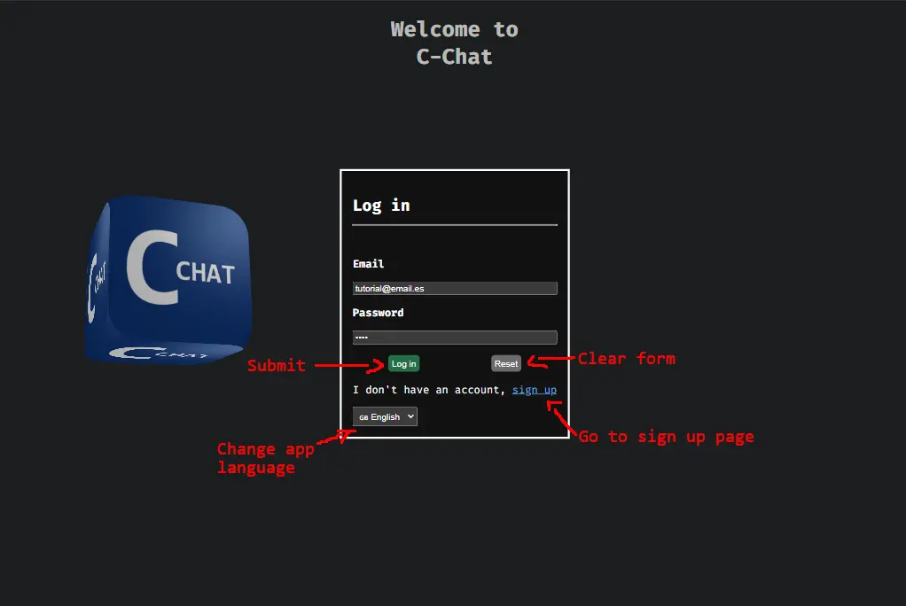 
  

    Si tienes una cuenta, rellena el formulario de inicio de sesión y accede a la app pulsando en confirmar, puedes resetear el formulario utilizando el botón "limpiar/reset".  
    Si no tienes una cuenta haz click en "No tengo una cuenta", puedes cambiar el idioma en el desplegable de abajo a la izquierda.
  

  <h3>Registro</h3>
  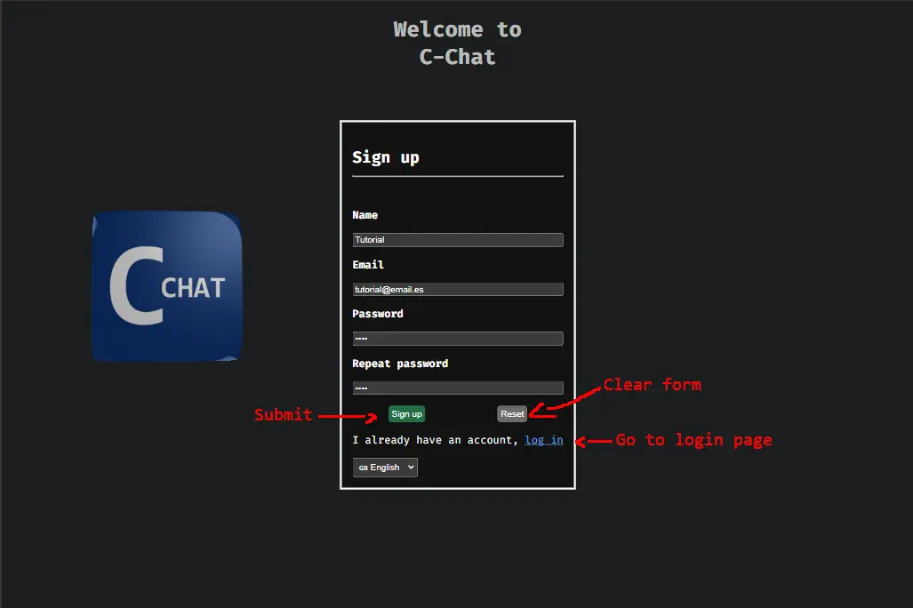
  

    Si no tienes una cuenta, rellena el formulario de registro y accede a la app pulsando en confirmar, puedes resetear el formulario utilizando el botón "limpiar/reset".  
    Si ya tienes una cuenta haz click en "Ya tengo una cuenta", para ir al inicio de sesión.
  

  <h3>Vista principal</h3>
  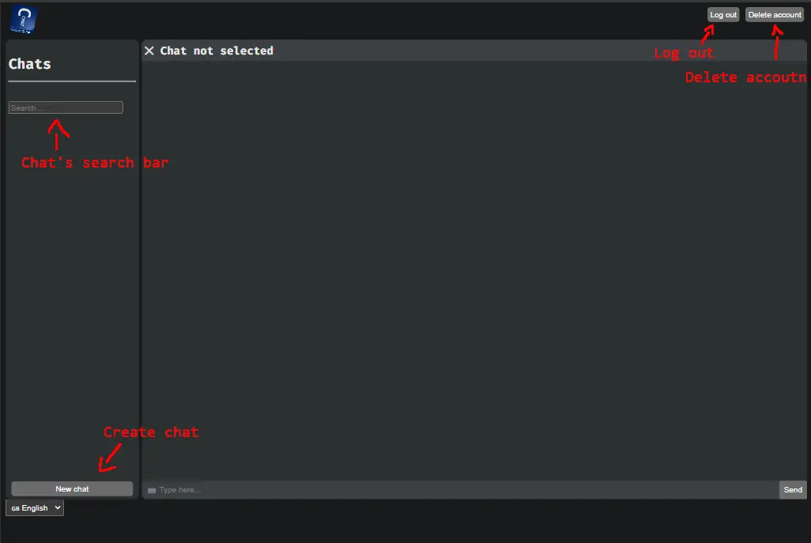
  

    En la vista principal dispones de varios paneles:
    <ul align="left">
      <li>
        Encabezado, con botones para cerrar sesión y borrar la cuenta.
      </li>
      <li>
        Panel de la lista de chats, aquí aparecerán los chats creados, además de un barra de busqueda y el botón para crear nuevos chats.
      </li>
      <li>
        Panel principla del chat, cuando un chat esté abierto aparecerá aquí.
      </li>
    </ul>
  

  <h3>Crear chat</h3>
  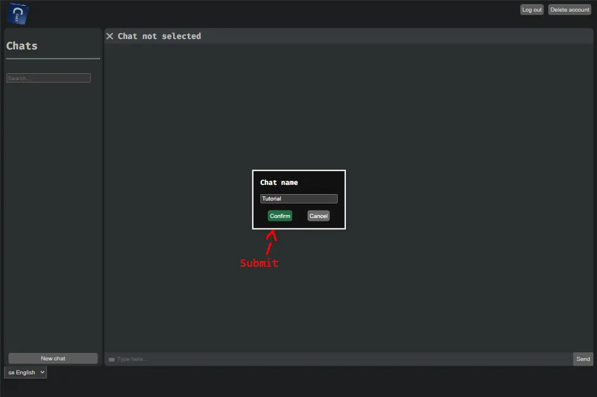
  

    Al pulsar el botón para crear un nuevo chat, aparecerá un dialogo para introducir el nombre del chat que queremos crear.
  

  <h3>Vista chat</h3>
  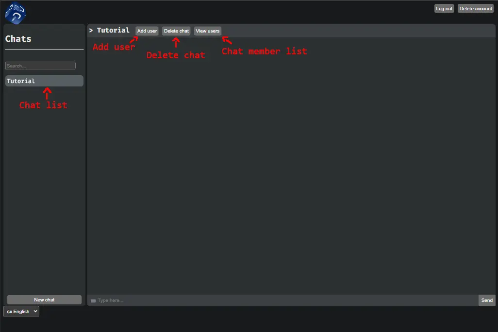
  

    Esta vista se verá al seleccionar un chat, aquí aparecerán una caja para escribir el mensaje a enviar y varios botones, uno para añadir usuarios otro para ver los miembros del chat y otro para borrar el chat.
  

  <h3>Enviar un mensaje</h3>
  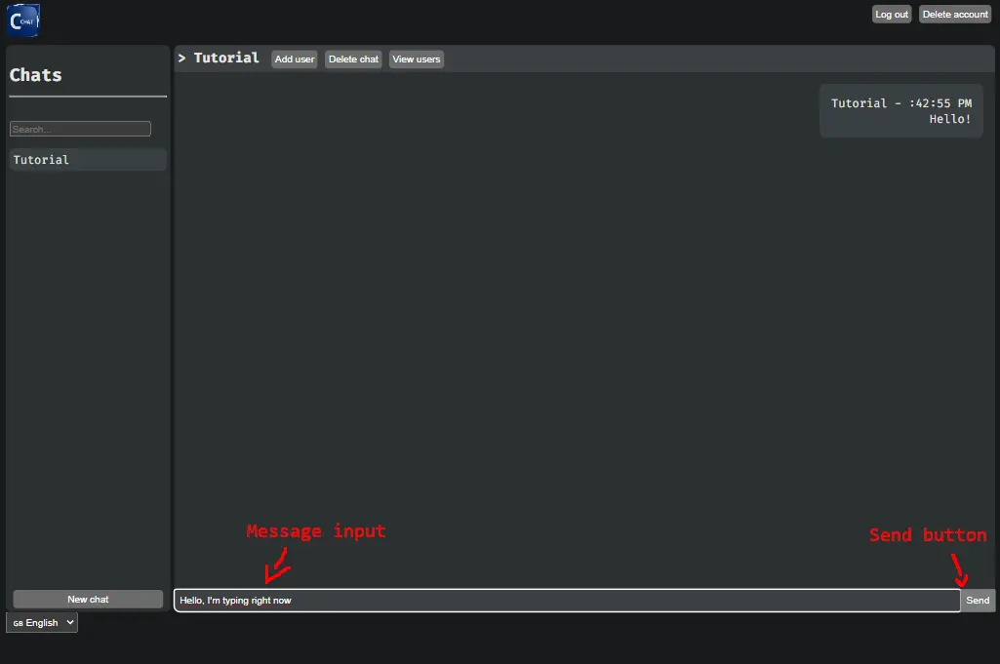
  

    En esta caja se escribe el contenido del mensaje y al pulsar "Enter" o el boton enviar se enviará.
  

  <h3>Añadir un usuario</h3>
  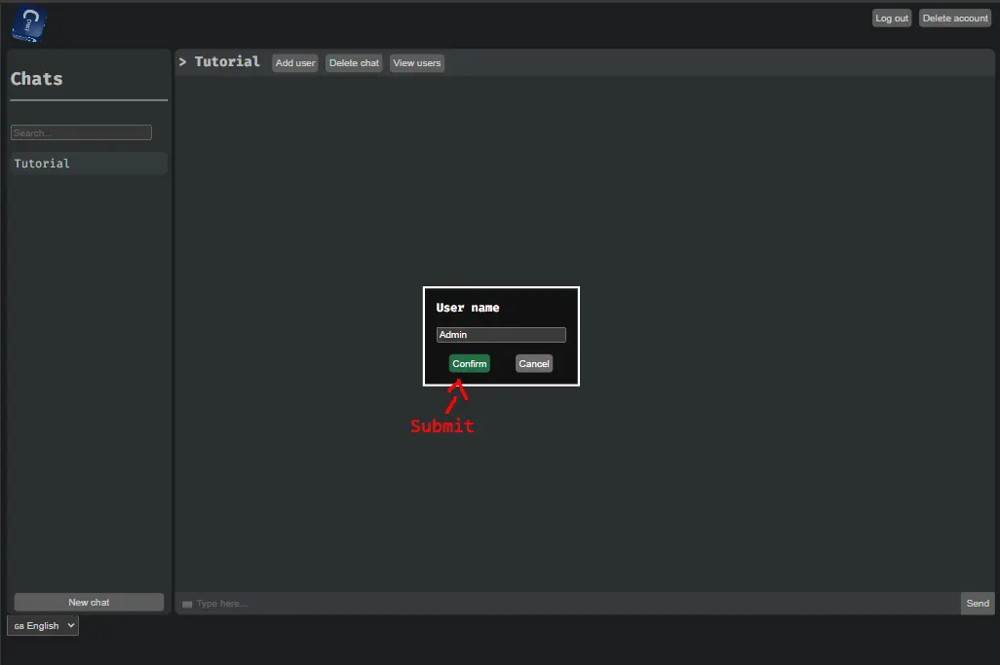
  

    Al pulsar el botón para añadir un usuario, aparecerá un dialogo para introducir el nombre del usuario que queremos añadir.
  

  <h3>Vista lista de usuario</h3>
  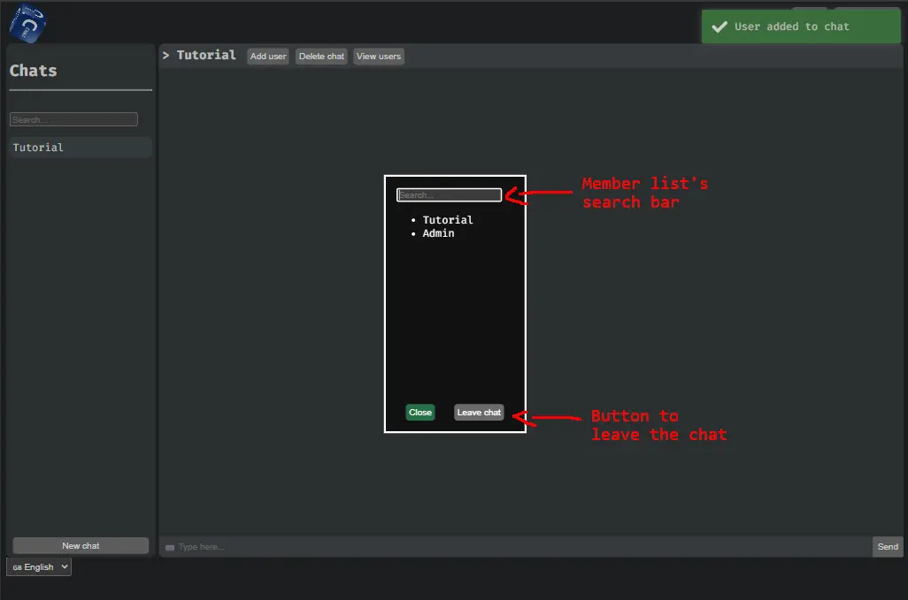
  

    Al pulsar el botón para ver los usuarios del chat, aparecerá una lista de los miembros junto a una barra de busqueda y un botón para abandonar el chat.
  

  <h3>Abandonar un chat</h3>
  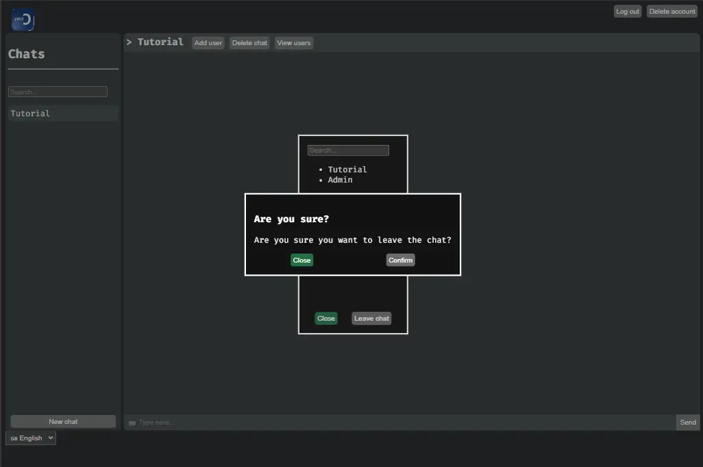
  

    Al pulsar el botón para abandonar un chat, aparecerá un dialogo confirmar si queremos realizar esta acción.
  

  <h3>Borrar un chat</h3>
  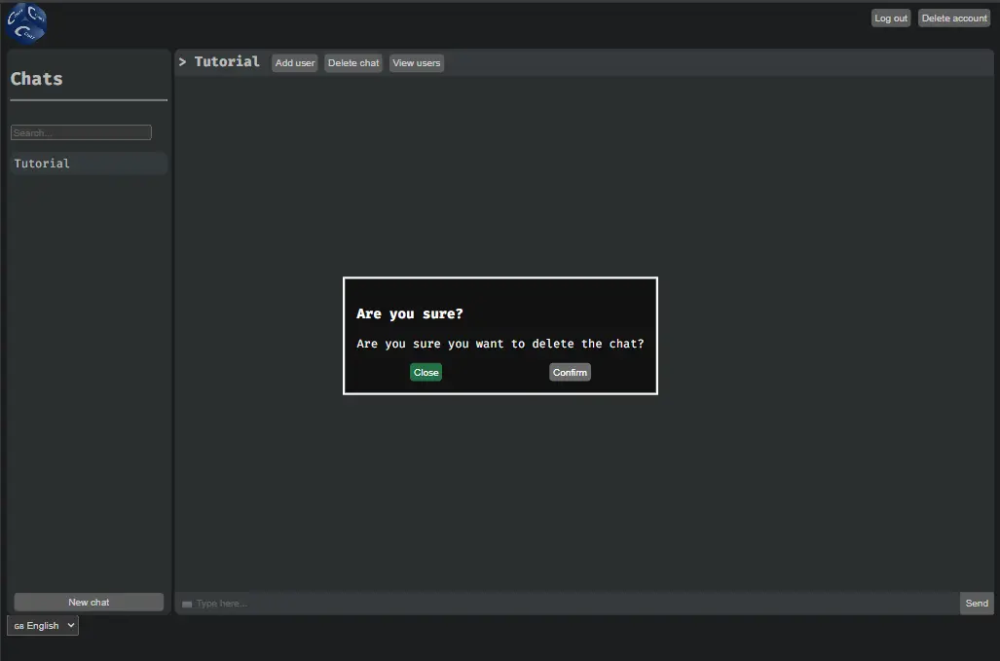
  

    Al pulsar el botón para eliminar un chat, aparecerá un dialogo confirmar si queremos realizar esta acción.
  

  <h3>Eliminar la cuenta</h3>
  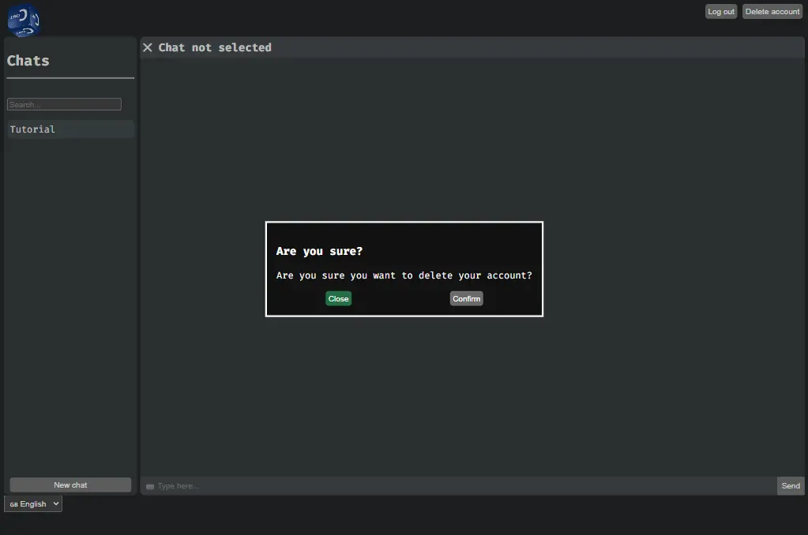
  

    Al pulsar el botón para eliminar la cuenta, aparecerá un dialogo confirmar si queremos realizar esta acción.
  

    
  <strong>Vídeo presentación</strong> 
   
  📄<a href="files/C-CHAT_Presentacion.pdf">Presentacion PDF</a>

    
  <strong>Vídeo checkpoint</strong> 
  

<h2 align="center">
  Boceto de la vista principal
  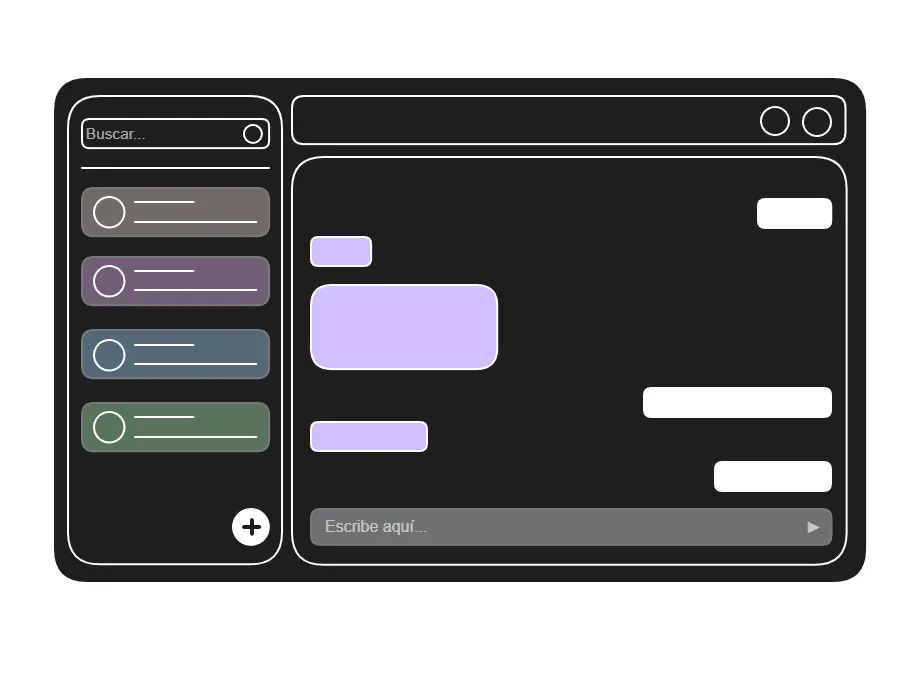
</h2>

<h2 align="center">
  Diagrama de la base de datos
  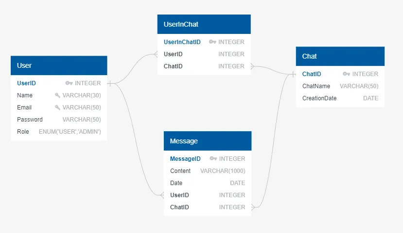
</h2>

<h2 align="center">
  Diagrama de flujo de la app
  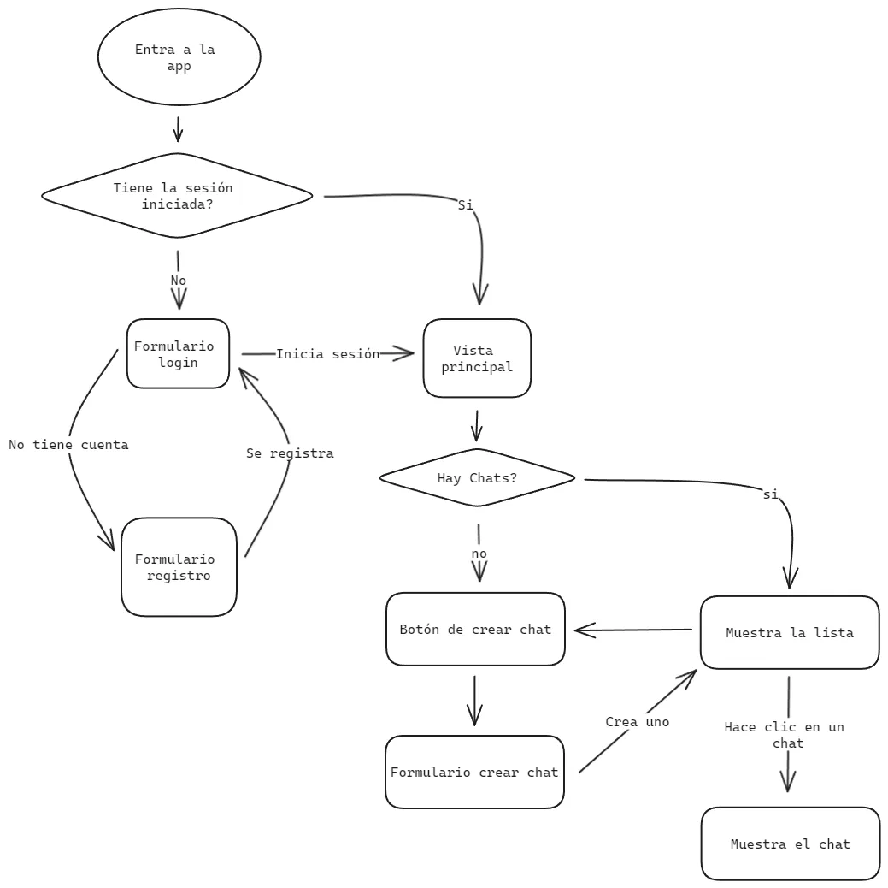
</h2>

# Historico
- 3 de abril de 2024: Creación del repositorio.
- 12 de abril de 2024: Creación del proyecto web y API.
- 29 de abril de 2024 (Backend):
  - Configuración del archivo Program.cs y Añadido JWT.
  - Creado dbContext.
  - Creadas enidades de la base de datos.
  - Endpoints registro e inicio de sesión.
- 30 de abril de 2024 (Backend): Arreglos, mensajes de respuesta y endpoint para eliminar usuarios.
- 3 de mayo de 2024 (Backend y Frontend):
  - Controlador de chat.
  - Endpoints para crear chats, borrarlos, añadir usuarios al chat y salir del chat.
  - Endpoints para obtener la lista de chats y la lista de chats de un usuario.
  - Más mensajes de respuesta.
  - Dtos del resto de entidades.
  - Vista principal
  - Formularios de registro e inicio de sesión.
- 4 de mayo de 2024 (Frontend):
  - Lista de chats.
  - Formulario de creación de chats.
  - Arreglos en los formularios de autenticación.
  - Distribución de los componentes en la interfaz con grid layout.
  - Chats seleccionables.
  - Estilos básicos.
- 5 de mayo de 2024 (Frontend): Formulario para añadir usuarios al chat.
- 8 de mayo de 2024: Actualización del Readme.
- 9 de mayo de 2024: Arreglos al añadir un usuario al chat y actualización del Readme.
- 15 de mayo de 2024 (Frontend):
  - Añadida lista de usuarios del chat.
  - Añadidos botones para borrar el usuario, abandonar y eliminar un chat.
  - Añadida barra de busqueda para la lista de chats.
  - Refactorización de BehaviorSubject a Signals.
- 16 de mayo de 2024 (Frontend): Barra de busqueda para la lista de usuarios de un chat.
- 25 de mayo de 2024 (Backend y Frontend):
  - Añadida capacided de enviar mensajes, los recibirán todos los usuarios pertenecientes al chat.
  - Al seleccionar los chats se recibirán los mensajes anteriores.
  - Añadidos scrolls para la lista de chats y el area del chat.
- 27 de mayo de 2024 (Base de datos): Migración de la base de datos a MySQL (Mensajes de error rotos).
- 28 de mayo de 2024 (Backend y Frontend): mensajes de error areglados, refactor de mensaje de Subjet a Signal y eliminados archivos no utilizados.
- 29 de mayo de 2024 (Frontend):
  - Scroll automático cuando un mensaje llega y cambios en el grid.
  - Al pulsar enter se envia el mensaje escrito.
  - Añadida responsividad básica.
  - Añadida accesibilidad con propiedades de HTML.
  - Añadidos botones de reset para las vistas de autenticación.
  - Añadida diferenciación a los botones preferentes, es decir, aquellos que pulsarías preferentemente y evitar posibles accidentes en lo que el usuario desea hacer.
- 1 de junio de 2024 (Backend y Frontend):
  - Arreglos en la responisvidad.
  - Instalación de la librería Toastr para notificaciones tipo toast.
  - Añadidas notificaciones con Toastr.
  - Añadido endpoint para determinar si el usuario es adminsitrador.
- 2 de junio de 2024 (Backend y Frontend):
  - DB Seeder con un usuairo administrador.
  - Refactorización y vista administrador.
  - Manejo de errores globales e intercepción de errores HTTP.
  - Añadido servicio para archivos estáticos.
- 3 de junio de 2024 (Frontend):
  - Añadida PWA.
  - Mejora vista de administrador.
  - Añadidos scrloss para el resto de listas.
- 4 de junio de 2024 (Backend y Frontend):
  - Refatorización en los controladores.
  - Dialogo de confirmación para acciones irreversibles.
  - Traducción de los mensajes devueltos por la API.
- 5 de junio de 2024 (Frontend):
  - Traducción de la web, toma el lenguaje por defecto del navegador.
  - Actualización del README.
- 6 de junio de 2024:
  - Mejora de la primera ventana que ve el usuario.
  - Despliegue de la base de datos.
- 7 de junio de 2024:
  - Añadida autenticación para eliminar un chat.
  - Añadida autorización de ADMIN para la lista de usuarios, de chats y el controlador de mensajes.
  - Eliminados endpoints de prueba.
  - Cambios en los mensajes de la consola.
  - Despliegue del frontend.
  - Despliegue del servidor.
  - Cambios en las rutas.
  - Mejoras en la responsividad.
  - Actualización del README.
- 8 de junio de 2024: Arreglos.
- 13 de junio de 2024: Arreglo en la fecha del mensaje y acutalización del readme.

---

# Bibliografía

- Angular 17: https://youtu.be/f7unUpshmpA
- Angular Signals:
  - https://angular.io/guide/signals
  - https://angular.io/api/core/EffectRef
  - https://youtu.be/RkOU2FkuO60
- ASP.NET Core: https://youtu.be/9VYn7oWY08M
- WebSockets:
  - https://youtu.be/SYoACrFXNRE
  - https://www.c-sharpcorner.com/article/real-time-communication-made-easy-demonstrating-web-sockets-with-angular/
- Dictionary: https://learn.microsoft.com/es-es/dotnet/api/system.collections.generic.dictionary-2?view=net-8.0
- Concurrent dictionary: https://learn.microsoft.com/es-es/dotnet/api/system.collections.concurrent.concurrentdictionary-2?view=net-8.0
- MySQL Connection: https://youtu.be/SdtOGowW-Dk
- ngx-toastr: https://www.npmjs.com/package/ngx-toastr
- PWA Angular: https://angular.dev/ecosystem/service-workers/getting-started
- MonsterASP deploy: https://help.monsterasp.net/books/deploy/page/how-to-deploy-net-core-web-api-with-swagger-using-visual-studio
- Exception handler: https://learn.microsoft.com/es-es/aspnet/core/fundamentals/error-handling?view=aspnetcore-8.0
