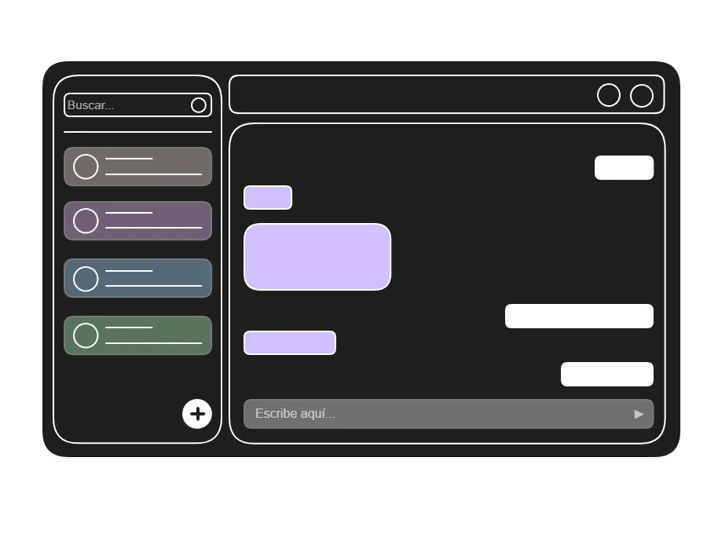
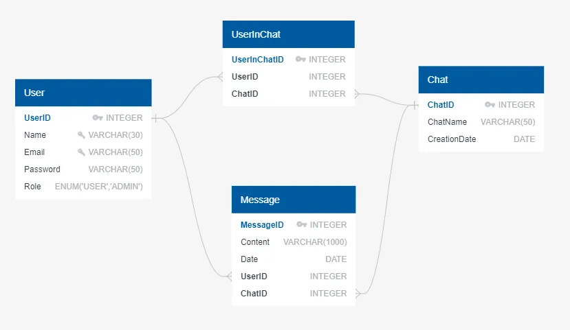
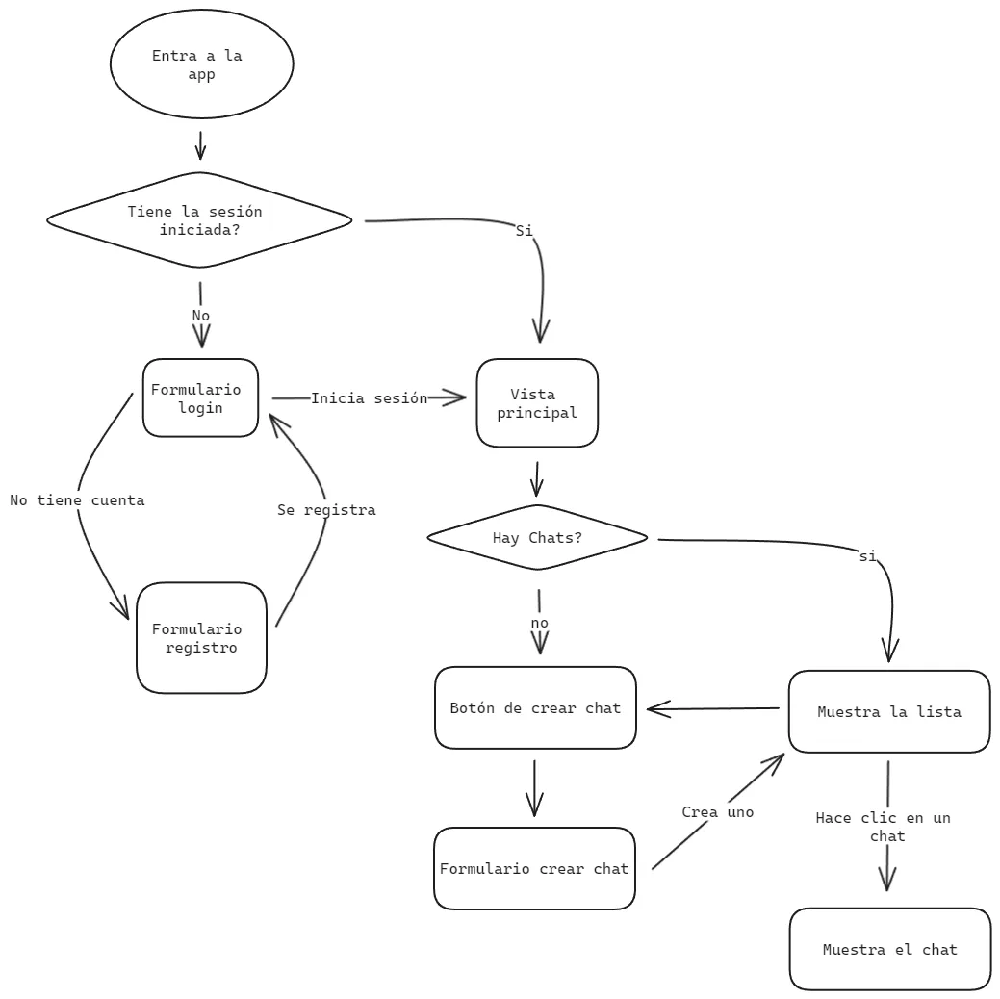

<h1 align="center">C-Chat</h1>

  
   
  <em>Aplicación de mensajería similar a WhatsApp o Discord
      Hecho con C# y Typescript</em>
   

  <a href="https://aromatic-tray-733.notion.site/Anteproyecto-C-Chat-0ca065f5e301446fb2b774a35fcd57ec?pvs=4"><strong>Anteproyecto</strong></a>
    
  <strong>Vídeo checkpoint</strong> 
  

<h2 align="center">Autor</h2>

   
  Luis Miguel García Sevilla - 2º DAM Tarde

---

<h2 align="center">
  Boceto de la vista principal
  
</h2>
<h2 align="center">
  Diagrama de la base de datos
  
</h2>

<h2 align="center">
  Diagrama de flujo de la app
  
</h2>

# Historico
- 3 de abril de 2024: Creación del repositorio.
- 12 de abril de 2024: Creación del proyecto web y API.
- 29 de abril de 2024 (Backend):
  - Configuración del archivo Program.cs y Añadido JWT.
  - Creado dbContext.
  - Creadas enidades de la base de datos.
  - Endpoints registro e inicio de sesión.
- 30 de abril de 2024 (Backend): Arreglos, mensajes de respuesta y endpoint para eliminar usuarios.
- 3 de mayo de 2024 (Backend y Frontend):
  - Controlador de chat.
  - Endpoints para crear chats, borrarlos, añadir usuarios al chat y salir del chat.
  - Endpoints para obtener la lista de chats y la lista de chats de un usuario.
  - Más mensajes de respuesta.
  - Dtos del resto de entidades.
  - Vista principal
  - Formularios de registro e inicio de sesión.
- 4 de mayo de 2024 (Frontend):
  - Lista de chats.
  - Formulario de creación de chats.
  - Arreglos en los formularios de autenticación.
  - Distribución de los componentes en la interfaz con grid layout.
  - Chats seleccionables.
  - Estilos básicos.
- 5 de mayo de 2024 (Frontend): Formulario para añadir usuarios al chat.
- 8 de mayo de 2024: Actualización del Readme.
- 9 de mayo de 2024: Arreglos al añadir un usuario al chat y actualización del Readme.
- 15 de mayo de 2024 (Frontend):
  - Añadida lista de usuarios del chat.
  - Añadidos botones para borrar el usuario, abandonar y eliminar un chat.
  - Añadida barra de busqueda para la lista de chats.
  - Refactorización de BehaviorSubject a Signals.
- 16 de mayo de 2024 (Frontend): Barra de busqueda para la lista de usuarios de un chat.
- 25 de mayo de 2024 (Backend y Frontend):
  - Añadida capacided de enviar mensajes, los recibirán todos los usuarios pertenecientes al chat.
  - Al seleccionar los chats se recibirán los mensajes anteriores.
  - Añadidos scrolls para la lista de chats y el area del chat.
- 27 de mayo de 2024 (Base de datos): Migración de la base de datos a MySQL (Mensajes de error rotos).
- 28 de mayo de 2024 (Backend y Frontend): mensajes de error areglados, refactor de mensaje de Subjet a Signal y eliminados archivos no utilizados.
- 29 de mayo de 2024 (Frontend):
  - Scroll automático cuando un mensaje llega y cambios en el grid.
  - Al pulsar enter se envia el mensaje escrito.
  - Añadida responsividad básica.
  - Añadida accesibilidad con propiedades de HTML.
  - Añadidos botones de reset para las vistas de autenticación.
  - Añadida diferenciación a los botones preferentes, es decir, aquellos que pulsarías preferentemente y evitar posibles accidentes en lo que el usuario desea hacer.
-  1 de junio de 2024 (Backend y Frontend):
  -  Arreglos en la responisvidad.
  -  Instalación de la librería Toastr para notificaciones tipo toast.
  -  Añadidas notificaciones con Toastr.
  -  Añadido endpoint para determinar si el usuario es adminsitrador.
-  2 de junio de 2024 (Backend y Frontend):
  -  DB Seeder con un usuairo administrador.
  -  Refactorización y vista administrador.
  -  Manejo de errores globales e intercepción de errores HTTP.
  -  Añadido servicio para archivos estáticos.
-  3 de junio de 2024 (Frontend):
  -  Añadida PWA.
  -  Mejora vista de administrador.
  -  Añadidos scrloss para el resto de listas.
-  4 de junio de 2024 (Backend y Frontend):
  -  Refatorización en los controladores.
  -  Dialogo de confirmación para acciones irreversibles.
  -  Traducción de los mensajes devueltos por la API.
-  5 de junio de 2024 (Frontend): Traducción de la web y actualización del README.

---
# C-Chat-Web

Ptoyecto creado con [Angular CLI](https://github.com/angular/angular-cli) versión 18.0.1.

## Servidor de desarrollo

Ejecuta el comando `ng serve` para lanzar el servidor de desarrollo. En la ruta `http://localhost:4200/` se desplegará la web.

## Compilación

Ejecuta el comando `ng build` para compilar el proyecto. Los archivos se almacenarán en el directorio `dist/`.

## Servidor de producción

Ejecuta el comando `npx http-server -p 8080 -c-1 dist/c-chat-web/browser` para lanzar un servidor HTTP en la ruta `http://localhost:8080/`. Pudiendo así hacer uso de la PWA.
